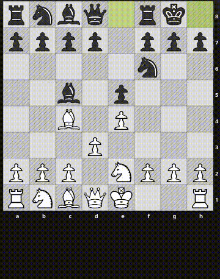

# Online Chess Enhancement Suite tutorial

This short animated tutorial will teach you how to use this extension in just 4 gifs.
Note that according to [Lichess Fair Play Guidelines](https://lichess.org/page/fair-play) you can't use this extension when competing against other players.

## Basic piece movement

Point at a square you want to move a piece to and press the key corresponding to the piece of your choice.

The default controls are written in the table below. They can be customized on the extension preferences page.

Key | Piece
--- | ----------
`W` |  &nbsp; Pawn
`A` |  &nbsp; Rook
`S` |  &nbsp; Knight
`D` |  &nbsp; Bishop
`E` |  &nbsp; King
`Q` |  &nbsp; Queen

## Disambiguation

If it's ambiguous which piece should move to a square that the cursor points at, the pieces which can move there are highlighted
and you narrow down the selection using keyboard (`A`, `W`, `S`, `D` keys) to select the piece of your choice.

Key | Disambiguation
----|----
`W` | Select the top piece
`D` | Select the piece on the right
`S` | Select the bottom piece
`A` | Select the piece on the left
`Esc` | Cancel highlight

In case you want to cancel the move disambiguation and make a different move, you can do so using the `Esc` key.

## Missclicks

The best thing about this extension is how fast the moves can be made.
It's natural that missclicks happen, especially when you're just learning.
If you select a piece which cannot move to the square under cursor, all pieces which can will be higlighted and you will
be asked to select the correct piece using the disambiguation keys which you know from the previous section (`A`, `W`, `S`, `D`).

If there's only one piece that can move to the square under cursor, you will be asked to confirm the move by pressing any of the `A`, `W`, `S`, `D` keys.
You can customize this behavior in extension preferences to move the piece without confirmation or to ignore missclicks altogether.

## Next steps

That's all there's to it!
Remember to only use this extension in solo mode.
You can try with [Puzzle Strom](https://lichess.org/storm) for starters.
Have fun!

Once you're comfortable with using the extension, make sure to look at the extension preferences to customize it to your liking.
