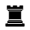
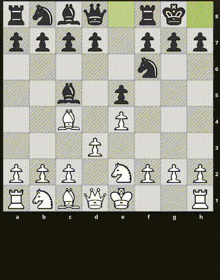
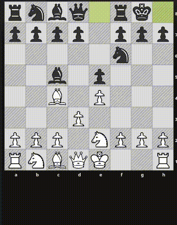

# online-chess-enhancement-suite

A web browser extension that allows to use keyboard and mouse to move pieces on [lichess.org](https://lichess.org).
To move a piece, point the mouse cursor to the square that you would like to move to and press a key corresponding to a type of piece which sould be moved there.

Shoutout to [Lichess-Keyboard-Input](https://github.com/Sentero-esp12/Lichess-Keyboard-Input) for the original idea.
It differs from the original extension in that all pieces of the same kind are controlled using the same key.

## Controls

The default controls are provided in the tables below, though they can be customized on the extension preferences page.

Piece | Key
------|----
 (Pawn) | `W`
 (Rook) | `A`
 (Knight) | `S`
 (Bishop) | `D`
 (King) | `E`
 (Queen) | `Q`

Disambiguation | Key
------|----
Select the top piece | `W`
Select the piece on the right | `D`
Select the bottom piece | `S`
Select the piece on the left | `A`
Cancel highlight | `Esc`

## Disambiguation

If it's ambiguous which piece should move to a square that the cursor points at, the pieces which can move there are highlighted
and you narrow down the selection using keyboard (`A`, `W`, `S`, `D` keys) to select the piece of your choice.

## Missclicks

The selling point of this extension is how fast the moves can be made.
It's natural that missclicks happen, especially when you're just learning to use it.
If you select a piece which cannot move to the square under cursor, all pieces which can will be higlighted and you will
be asked to select the correct piece using the disambiguation keys which you know from the previous section (`A`, `W`, `S`, `D`).

In case you want to cancel the move disambiguation and make a different move, you can do so using the `Esc` key.

